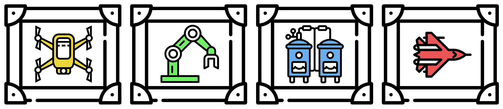

# Control Systems Gallery

The Control Systems Gallery is a Python module that documents a standard collection of systems for use in
the analysis and design of feedback control with a focus on state-space models.

# Features

- Continuous-time and discrete-time systems
- Easy integration with the [Python Control package](https://github.com/python-control/python-control)

# Links

- TBD

# Conventions

- System parameters are stored in dictionaries as pickle files
- System definitions are catalogued by a unique system ID number with format 'cXXXXXXXXXX'
  - 'c' is a character 'c' or 'd' corresponding to continuous-time or discrete-time
  - 'XXXXXXXXXX' is a unique 10-digit integer
- At a minimum each system must have A and B matrices
- Additional parameters are stored as needed e.g. C and D matrices
- Column and row vectors are treated as single-dimensional NumPy arrays

# Dependencies

The Control Systems Gallery package requires the NumPy package. 

# Installation

## Conda and conda-forge

TBD

## Pip

TBD

# Development

## Code

You can check out the latest version of the source code with the command:

  git clone https://github.com/BenGravell/control-gallery.git

## Testing

TBD

## License

This is free software released under the terms of the MIT License. There is no warranty; not even for merchantability or fitness for a particular purpose. Consult LICENSE for copying conditions.

When code is modified or re-distributed, the LICENSE file should accompany the code or any subset of it, however small. As an alternative, the LICENSE text can be copied within files, if so desired.

## Contributing

Your contributions are welcome!  Simply fork the GitHub repository and send a
[pull request](https://github.com/BenGravell/control-gallery/pulls).

Icons made by
<a href="https://www.flaticon.com/authors/smashicons" title="Smashicons">Smashicons</a>, 
<a href="https://www.flaticon.com/authors/eucalyp" title="Eucalyp">Eucalyp</a>,
<a href="https://www.flaticon.com/authors/pixel-perfect" title="Pixel perfect">Pixel perfect</a>, 
<a href="https://www.flaticon.com/authors/smalllikeart" title="smalllikeart">smalllikeart</a>, and
<a href="https://www.flaticon.com/authors/freepik" title="Freepik">Freepik</a>
from <a href="https://www.flaticon.com/" title="Flaticon"> www.flaticon.com</a>.
